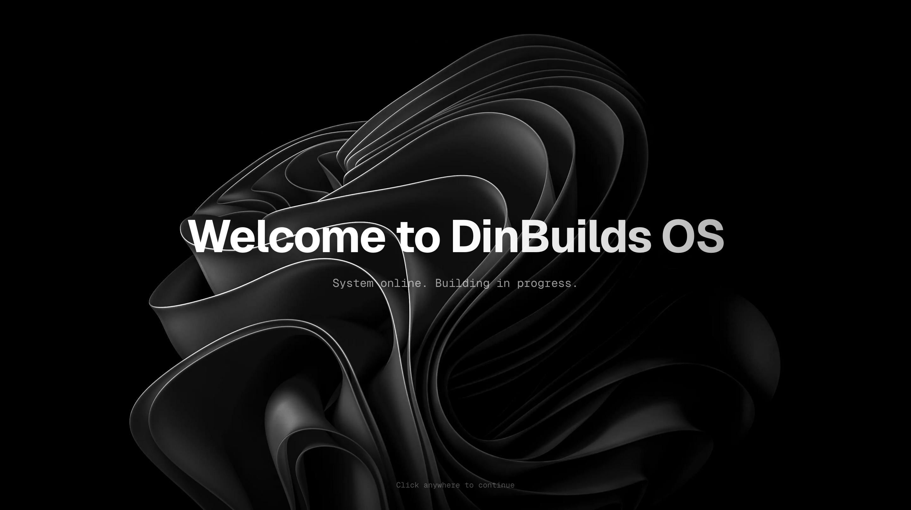

# DinBuilds OS

A portfolio presented as a desktop OS so you can explore projects, experience, and design decisions the way I build them.

  

## Overview

DinBuilds OS is a portfolio that behaves like a windowed desktop environment. Instead of scrolling through a static page, you open apps, read project docs in a Markdown viewer, and navigate with a dock, folders, and a terminal. The intent is to make the portfolio itself a product demonstration, not just a wrapper around links.

It reflects an engineering mindset that values structure, discoverability, and interaction. The site is designed to be navigable, inspectable, and honest about how it works.

## Tech Stack

- Next.js App Router: Server rendering plus URL driven state so individual windows and documents are indexable and linkable.
- React 19 and TypeScript: Predictable component contracts for a UI that behaves like an OS.
- Tailwind CSS v4: Design tokens via CSS variables with fast iteration on dense UI surfaces.
- Zustand: Minimal state container for the window manager, dock, and system preferences.
- Framer Motion: Boot sequence, window transitions, and reduced motion support without bespoke animation code.
- React Hook Form and Zod: Contact form validation with clear client and server boundaries.
- Resend and Redis: Email delivery and rate limiting for the contact flow, both optional in local dev.
- Vercel Analytics: Privacy first event tracking for UX funnels and system behaviors.

## Quick Start

- Install dependencies with `pnpm install`.
- Start the dev server with `pnpm dev`.
- Open `http://localhost:3000`.
- Optional for contact form: copy `.env.example` to `.env.local` and set `RESEND_API_KEY` and `REDIS_URL`.

## Project Structure

- `app/`: Next.js routes, metadata, and server entry points.
- `src/features/os/`: Window manager, boot flow, desktop, dock, onboarding, notifications.
- `src/features/apps/`: App windows such as About, Terminal, Projects, Settings, Contact, and Markdown viewer.
- `src/lib/`: SEO, analytics, and URL state helpers.
- `public/readmes/`: Project and experience documents rendered by the Markdown viewer.

## Design and Engineering Notes

- URL driven state powers deep links such as `?app=projects` or `?app=markdown&file=yield`, enabling SEO and shareable views.
- Apps are lazy loaded to keep initial boot fast while still supporting rich interactions.
- Preferences like wallpaper and dock position persist, but window state is intentionally ephemeral.
- The contact flow fails safely when external services are missing, prioritizing site stability over strict delivery guarantees.
- Heavy UI elements favor GPU friendly transitions and reduced motion fallback to keep the experience smooth.

## What This Portfolio Is Not

- Not a template or starter for building other portfolios.
- Not a CMS or content platform.
- Not a full operating system, just a playful UI metaphor.

## Side Note

Yes, it is a portfolio that bootstraps, has a terminal, and ships its own desktop. No, I did not build it to avoid updating my resume. Probably.
